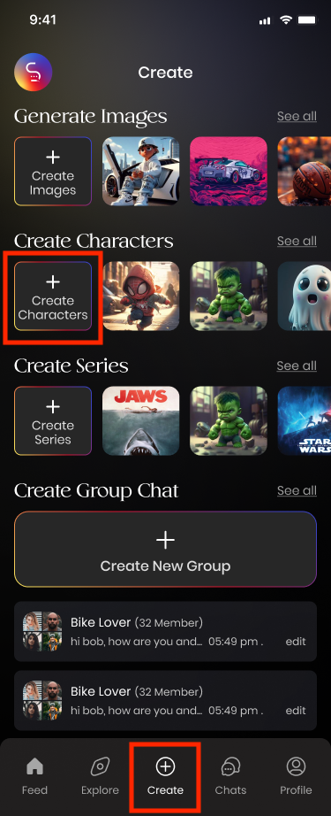

# Create Characters

The Storychat App allows you to easily create and share characters in a mobile environment.

## How to Create Characters

<figure><figcaption></figcaption></figure>

**Touch the Create tab** at the bottom of the main screen.

<figure><figcaption></figcaption></figure>

**Upload a profile picture for the character.**

Since Storychat emphasizes images in character alignment, choose a distinctive photo that clearly shows the character’s face and captures attention, rather than a very small image.

**Upload a background image for the character.**

This image will be displayed on the character’s profile page. It is recommended to select a scene or related image that reveals the character's characteristics, helping users understand the character better.

<figure><figcaption></figcaption></figure>

**Enter the character's name.**

The character's name helps the AI understand the basic information about the character. For existing IPs, precise text input is essential.&#x20;

The character's name is one of the most critical factors for users when searching for characters.

**Enter character details,** which significantly influence the character’s conversational style. The following information can be input:

* **Age**
* **Gender**
* **Physical Appearance**&#x20;
* **Description**
* **First Message**
* **Personality Summary**
* **Likes**
* **Make Public Character**
* **Enable NSFW content**

When entering details, you can quickly generate a character using sample sentences or create a more detailed character by directly inputting text for each field.&#x20;

For the Description, write in the first person from the character's perspective; clearer sentences enhance character performance.&#x20;

> Example: "I am a knight wielding a large sword."

#### Make Public Character

Checking this option allows the created character to be shared with the community, making it accessible for everyone to use and interact with. This option must be enabled for monetizing character creation.

#### Enable NSFW content

If the character involves explicit or violent images and concepts, this option must be enabled. Failure to activate this option when providing NSFW content may result in penalties according to the regulations.

**Share Your Character with the Community!**

A large number of StoryChat users are active on Discord. By sharing your character on Discord, you can allow more users to discover and experience it.

Join our Discord here: [https://discord.gg/fAEG3KuPMM](https://discord.gg/fAEG3KuPMM)

Currently, character sharing is available on the web (the feature will be updated on the app soon).

[https://web.storychat.app/my-profile](https://web.storychat.app/my-profile)

1\. Log in to the website and click on the Profile button.

<figure><figcaption></figcaption></figure>

2\. Under My Characters, select your character and click the Share icon to copy the character’s URL.

<figure><figcaption></figcaption></figure>

3\. Paste the URL in the Character-Share channel on Discord, and include a description and an image of your character before sharing!

<figure><figcaption></figcaption></figure>

Let your creations shine and engage with the community.

