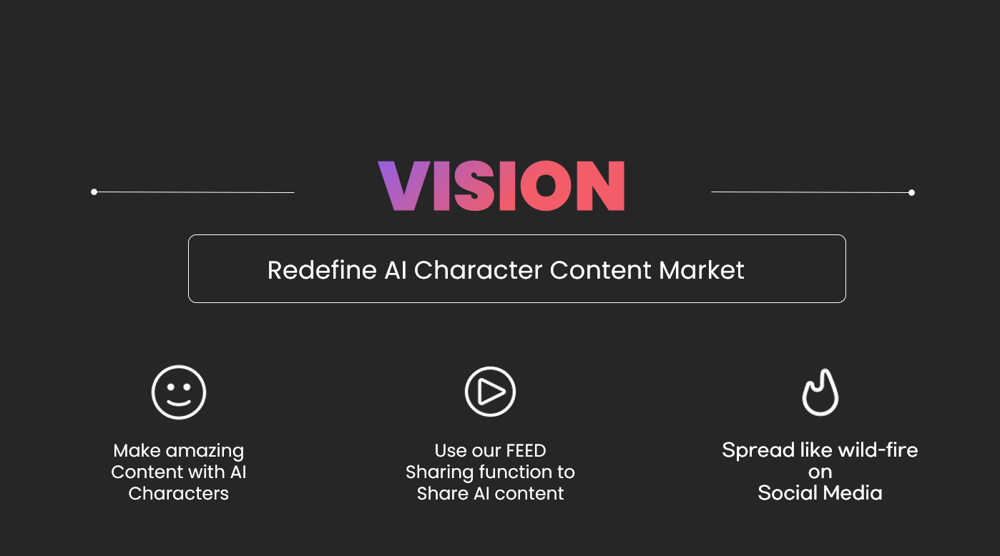

# Vision

<figure><figcaption></figcaption></figure>

## Storychat의 비전

Storychat은 AI를 통해 콘텐츠를 쉽게 제작할 수 있도록 지원합니다. 또한, Feed 기능을 통해 크리에이터들이 그들의 콘텐츠를 커뮤니티에 쉽고 효과적으로 공유할 수 있으며, 블록체인을 통해 기여도를 정확하게 측정하고 보상합니다.

즉, 소비자와 크리에이터의 경계가 허물어지며, 참여자 누구나 쉽게 크리에이터가 되어 다양한 콘텐츠를 제공할 수 있는 환경을 조성합니다.

이를 통해, 우리는 콘텐츠 시장과 소셜 미디어 시장을 재정의하며, 모두가 즐길 수 있는 플랫폼을 제공하여 빠르게 확산시킬 것입니다.

## 장기적 비전

AI가 빠르게 발전하면서 인류에게 미치는 효용성과 그 영향력은 갈수록 커지고 있습니다. Storychat은 다가오는 대 AI 시대에 올바르고 공정한 방향성을 제시하고 기여하고자 합니다.

**개방된 AI:** AI 기술은 전 세계 누구나 공평하게 누릴 수 있어야 합니다. Storychat은 대기업이 AI 기술과 정보를 독점하는 것이 아닌, 오픈소스 모델을 통해 생태계 참여자 누구나 기여하고 사용할 수 있는 AI를 지향합니다.

**공정한 보상:** 블록체인의 등장으로 모두가 동의할 수 있는 자동화된 보상 모델을 구축할 수 있게 되었습니다. 플랫폼의 성장은 개인들의 기여로 이루어지며, 모든 기여는 소중합니다. Storychat은 모든 Story Makers, Chatbot Makers, IP Holders, KOL들의 기여를 존중하며 그들에게 합당한 보상을 제공할 것입니다. 이는 플랫폼의 더 큰 성장으로 이어집니다.

Storychat은 이러한 원칙을 통해 AI 시대의 콘텐츠 생태계를 혁신하고, 모두가 참여하고 공정하게 보상받는 플랫폼을 만들어가겠습니다.
