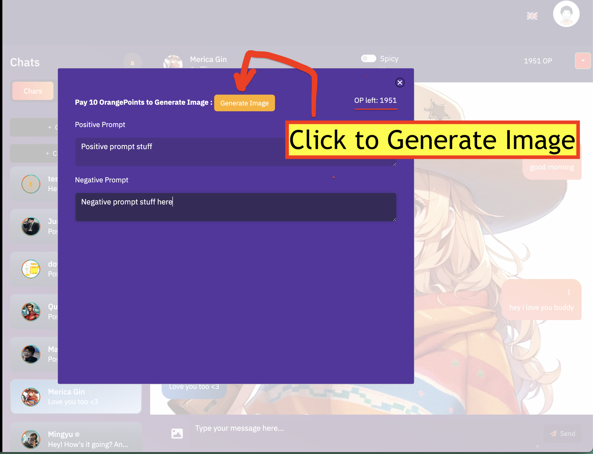
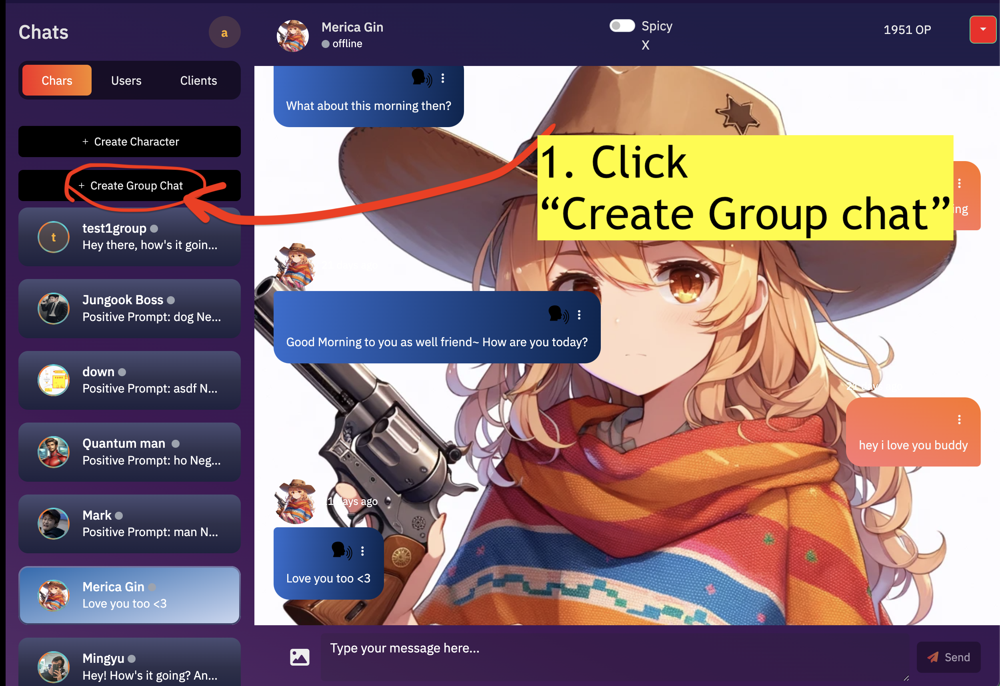
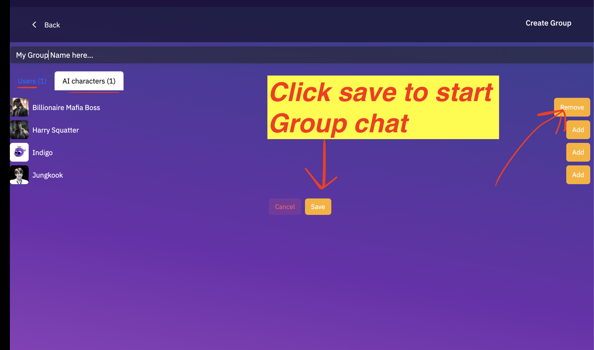

# ✨ Our Features


**Follow youtube for more tutorials and tips:** [**https://www.youtube.com/@redchatapp**](https://www.youtube.com/@redchatapp)&#x20;


## 1. Create images in character chat&#x20;

Click the image button in the chat to make an image generation prompt

<figure><figcaption></figcaption></figure>

##

<figure><figcaption></figcaption></figure>

## 2. Make a Group Chat with other users

Add another user to chat together with Ai Characters

<figure><figcaption></figcaption></figure>

<figure><figcaption></figcaption></figure>

<figure><figcaption></figcaption></figure>
