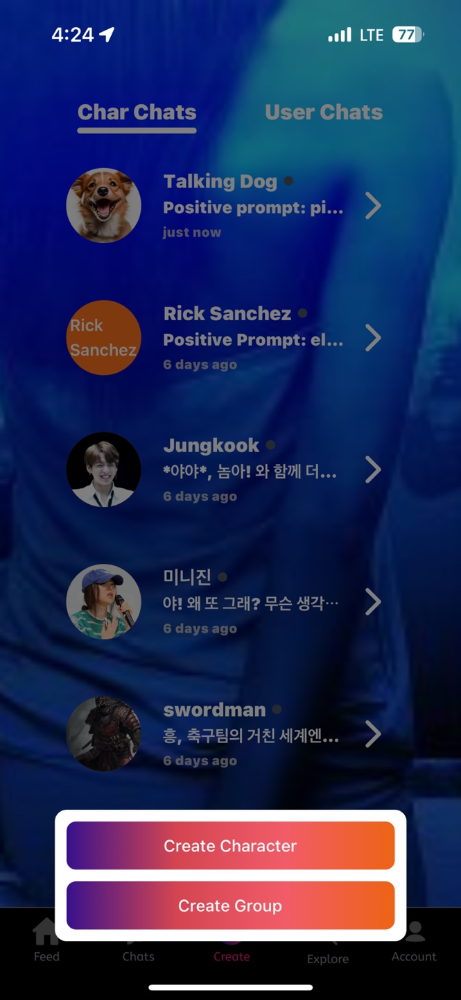

# Chats

<figure><figcaption></figcaption></figure>

## What is Chat?

Chats 탭에선 진행 중인 대화의 목록을 살펴볼 수 있으며 곧바로 진행 중인 대화를 재개할 수 있습니다.

Storychat에는 2가지 유형의 대화가 존재합니다.

* **1:1 AI CHAT** : 캐릭터 AI와 유저가 1:1로 대화하는 형태의 가장 일반적인 대화 방식 입니다. 대화 진행 중 재미있는 대화문들을 콘텐츠로 생성할 수 있습니다.
* **Group Chat** : 1:1 AI CHAT에서 발전된 형태로 여러 AI와 대화를 하거나, 하나의 AI와 여러명의 유저가 동시에 대화를 할 수 있는 방식입니다.  다양한 개체가 참여하는 만큼 더 풍부한 콘텐츠가 생성될 수 있습니다.

<figure><figcaption></figcaption></figure>

## Features

Storychat은 매우 다양한 채팅 기능을 제공합니다.

### Create Image & Video

간단한 프롬포트 입력을 통해 AI 생성 이미지 혹은 비디오를 제작할 수 있습니다.

현재 단계에서 지원하는 사이즈와 생성 타입은다음과 같습니다.

* 사이즈
  * High : 1024 x 1024
  * Low :  64 x 64\

* 생성 타입
  * Text to Image
  * Image to Image

<figure><figcaption></figcaption></figure>

생성하길 원하는 이미지의 정보를 Positive Prompt와 Negative Prompt에 입력하여 이미지 생성을 시작할 수 있습니다.

* Positive Prompt : 생성하고 싶은 대상
* Negative Prompt : 결과물에서 제외하고 싶은 대상&#x20;

### Voice Mode

AI 캐릭터의 답변을 음성으로 재생할 수 있습니다.&#x20;

자동 재생 모드를 통해 마치 AI  캐릭터와 통화하는 것과 같은 경험을 할 수 있습니다.

### Create Story

사용자가 AI 캐릭터와 나눈 대화를 활용하여 Story를 만들고 Feed에 공유할 수 있습니다.

Storychat의 AI 대화와 Story 제작 기술을 활용하여 매우 간편하고 쉬운 방법으로 빠르게 콘텐츠를 생성할 수 있습니다.

이를 통해 기존 웹소설, 웹툰 크리에이터에게 참신한 영감을 주고 작업 시간을 크게 단축시킵니다. 뿐만 아니라 사용자 그 누구도 매우 쉽게 크리에이터가 될 수 있습니다.

성공적인 Story를 만들고 Feed에서 긍정적인 반응을 얻는 Story Maker가 된다면 수익을 창출할 수도 있습니다.

Story를 생성하는 자세한 방법은 [Tutorial](2.-generate-an-image.md#create-story)에서 더 알아볼 수 있습니다.

### Role play Mode

Storychat의 캐릭터 AI는 매우 영리합니다!

Storychat에 생성된 AI 캐릭터들은 사용자의 대화와 어투를 이해하며 심지어 제스쳐나 행동 까지도 이해할 수 있습니다.

마찬가지로 AI 캐릭터는 대화와 행동을 적절히 조합하여 답변할 수 있으며 가시적인 UI를 통해 대화와 행동을 나누어 표시해줍니다.

일반적인 대화문과 달리 제스쳐나 행동은 \* 표시로 감싸져 표시됩니다.\
ex) \*뺨을 때리며\*

이 놀라운 경험을 하기 위해 해야할 것은 오직 Role play Mode를 켜는 것입니다. 대화만 하고싶다면 다시 한번 터치하여 손쉽게 끌 수 있습니다.

### Switch Language

AI와 대화하다 보면 번역기를 사용한 것 같은 특유의 어색한 문장들을 자주 마주쳤을 것입니다.&#x20;

Storychat의 AI는 다양한 언어 환경을 매우 자연스럽게 제공하며 Switch Language 버튼을 클릭하여 원하는 언어를 선택하기만 하면 됩니다.

현재 지원 언어 (총 9종)

* 영어
* 한국어
* 일본어
* 중국어
* 파키스탄어
* 필리핀어
* 러시아어
* 스페인어
* 베트남어

### Select AI or Character

언어와 마찬가지로 AI 모델과 대화하고 있는 캐릭터의 설정도 자유롭게 변경이 가능합니다.

AI 모델이 달라지면서 답변과 캐릭터의 어투 또한 조금씩 달라질 것입니다.

새로운 캐릭터와 대화하고 싶은데, 신규 캐릭터가 기존의 대화 내용을 기억하길 원한다면 채팅 도중 Select Character 버튼을 통해 캐릭터를 교체할 수 있습니다.

### Reset

반대로 캐릭터의 기억을 삭제하고 처음으로 돌아가 새로운 대화를 하고 싶다면 Reset을 통해 신규 대화를 시작할 수 있습니다.&#x20;

